# 📷 Website screenshot app

A server that receives an object containing a URL, takes a screenshot of the URL website, creates a video from the screenshot and returns the path of the video.
</br>
</br>
The given diagram does not describe the current implemantation exactly, it is only for the submission.

```mermaid
graph TD
    client("client 💻")
    S3("S3 🗂")
    lambda("AWS Lambda")


    client--1.Runs a lambda function-->lambda
    lambda--2.Saves the video file-->S3
    lambda--3.Returns the location of the file-->client
    client--4.Access saved files-->S3

```

</br>
</br>



## 📃 Requirements

- Node js 18
- Modules
  - puppeteer
  - videoshow
  - path (tests)
  - jest (tests)
- FFMPEG installed [http://ffmpeg.org/]

## 📦 Usage

To use the application you must send a valid URL to the handler function.

```js
{
  url: "http://www.google.com";
}
```

A screenshot will be taken from this address and a video will be created.
The function returns an object containing the path to the video.

```js
{
  file: "C:\\Repositories\\website-screenshot-app/videos/b7ca.mp4";
}
```

## 🏃‍♂️ Running steps

- Installation requirements
- Running the tests with the command:

```js
 npm test
```

If the test was successful, you can see in the terminal a printout of the path where the video is saved.

## 🧪 Tests

Unit test written with Jest.
